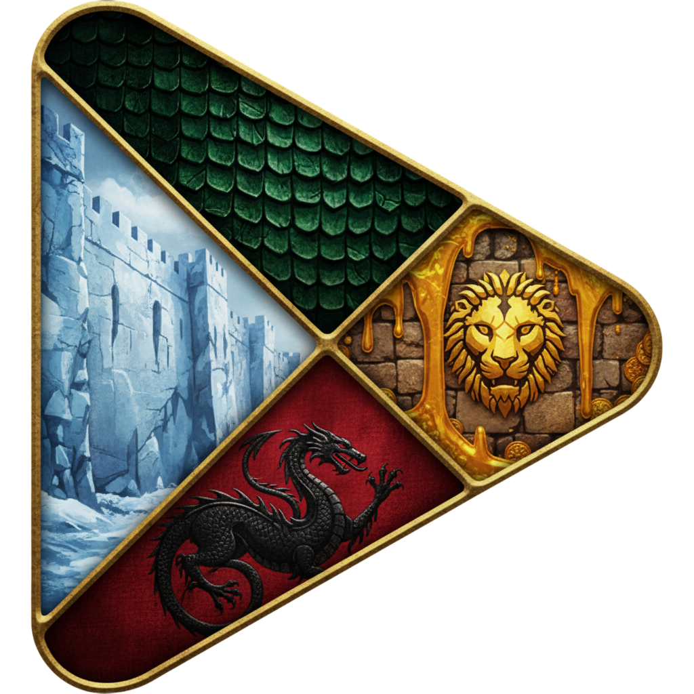

# Game of Thrones-Themed Google Play Web Project

## Overview
This project is a **Game of Thrones (GOT)–themed Google Play–style web interface** that showcases apps and games in an **immersive, fantasy-inspired environment**. It combines **interactive UI components, aesthetic design elements, and functional app previews**, offering users a unique experience reminiscent of the GOT universe.

The project blends **modern web design principles** with **thematic fantasy styling**, making it both visually engaging and user-friendly.

---

## Features & Specialties

### 1. Thematic Design
- **GOT-inspired UI:** Fonts, colors, and layout reflect the Game of Thrones universe.
- **Custom Fonts & Styling:** Medieval, serif, and fantasy-style fonts enhance authenticity.
- **Backgrounds & Animations:** Dragon animations, castle backdrops, and scroll-like components.

### 2. App Showcase
- **Interactive App Cards:** Each app has a clickable card with name, description, and key features.
- **In-Development App Pop-ups:** A GOT-themed popup with a dragon animation appears for apps under development.
- **App Categorization:** Apps and games are organized for easy navigation.

### 3. Interactivity & UX
- **Hover Effects:** Cards highlight with animations on hover.
- **Responsive Layout:** Optimized for desktop, tablet, and mobile screens.
- **Drag & Drop Sorting (Future):** Allows users to reorder apps visually.

### 4. Backend-Ready Structure
- **Scalable Architecture:** Ready for API integration to fetch app data dynamically.
- **Modular Components:** Reusable sections like app cards, pop-ups, and headers.
- **Theme Toggle (Planned):** Light/Dark mode integration while keeping the GOT theme.

### 5. Animation & Special Effects
- **Dragon Animation:** Appears for in-development apps or key interactions.
- **Scroll Effects:** Smooth scrolling with thematic transitions.
- **Click & Hover Animations:** Adds depth and engagement to app cards and pop-ups.

---

## Technologies Used
- **HTML5 & CSS3** – Structure and styling
- **JavaScript (ES6)** – Interactivity and animations
- **Google Fonts & Custom Fonts** – Thematic typography
- **CSS Animations & Transitions** – Smooth effects for pop-ups and hover interactions
- **Responsive Design** – Flexbox & Grid layouts for device adaptability

---

**Step into the world of apps… where dragons, castles, and tech collide.**
